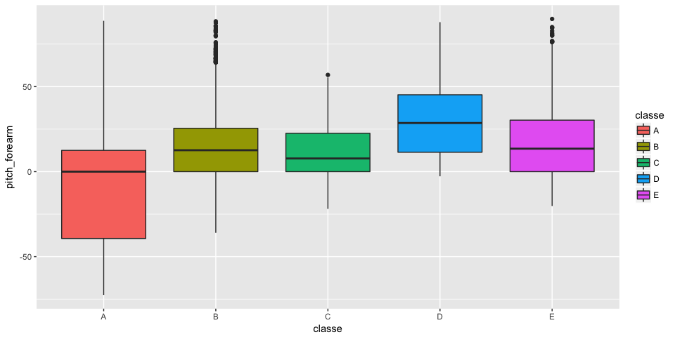
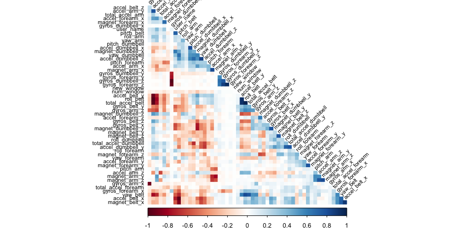

## Summary

Using the dataset provide by HAR [http://groupware.les.inf.puc-rio.br/har](http://groupware.les.inf.puc-rio.br/har) our goal is to predict the manner in which the Unilateral Dumbbell Biceps Curl Excercise is performed. On the dataset 159 features are measured by sensors while performing the exercise in five different fashions: exactly according to the specification (Class A), throwing the elbows to the front (Class B), lifting the dumbbell only halfway (Class C), lowering the dumbbell only halfway (Class D) and throwing the hips to the front (Class E).

We will select a model to predict the manner in which the exercise was performed. Our prediction model must be used to predict 20 different test cases. 

Steps that will be performed:

* Clean the Data
* Exploratory Analisys
* Model Selection
* Conclusion
* Use the model to predict final test cases

Libraries used:
library (corrplot)
library(caret)
library(randomForest)


## Clean the Data


```r
training=read.csv("pml-training.csv")
testing=read.csv("pml-testing.csv")
```


Explore the size, headers and summary:

```r
dim(training)
```

```
## [1] 19622   160
```

```r
# str(training) # output excluded from report
# head (training) # output excluded from report
# summary(training) # output excluded report
```


There are a lot of features (columns) with NA / missing values. We will remove the ones with more than 20% NA/missing values: 


```r
maxNAcol=20
maxNAcount <- nrow(training) / 100 * maxNAcol
colsToRemove<-which(colSums(is.na(training) | training=="") > maxNAcount)
length(colsToRemove)
```

```
## [1] 100
```

```r
trainingReduced <-training[,-colsToRemove]
testingReduced <-testing[,-colsToRemove]
```

There seems to be also some timestamp related data for the sensors which we will not be using. Lets remove them from the dataset:

```r
colsToRemove<-grep('timestamp',names(trainingReduced))
testingReduced1 <-testingReduced[,-colsToRemove]
trainingReduced1 <-trainingReduced[,-colsToRemove]
```

Then convert all factors to integers

```r
classeLevels <- levels(trainingReduced1$classe)
trainingReduced2 <- data.frame(data.matrix(trainingReduced1))
trainingReduced2$classe <-factor(trainingReduced2$classe,labels=classeLevels)
testingReduced2 <- data.frame(data.matrix(testingReduced1))
```

Also removing the X variable since it only indicates the row number (index)

```r
testingReduced3<-testingReduced2[,-1]
trainingReduced3<-trainingReduced2[,-1]
```

The resulting training set and testing set:

```r
trainingSet<-trainingReduced3
testingSet<-testingReduced3
```


## Exploratory Analisys 

The test set provided contains only the 20 cases which we will predict to evaluate our model. We will partition the training set, so we can have a small set to validate our model, before testing.


```r
set.seed(666)
classeIndex <- which(names(trainingSet) == 'classe')
inTrain <- createDataPartition(y=trainingSet$classe,p=0.75,list=FALSE)
trainingSubSet <- trainingSet[inTrain,]
validateSubSet <- trainingSet[-inTrain,]
```

First lets check if any variable has high correlation with classe, which might lead us to use a linear model:


```r
correlations <- cor(trainingSubSet[, -classeIndex], as.numeric(trainingSubSet$classe))
bestCorrelations <- subset(as.data.frame(as.table(correlations)), abs(Freq)>0.3)
bestCorrelations
```

```
##             Var1 Var2      Freq
## 44 pitch_forearm    A 0.3485245
```

Even the best correlation with classe are hardly above 0.3
We can check visually to see if there is any linear trend:


```r
bestCorPlot <- ggplot(trainingSubSet, aes(classe,pitch_forearm)) +
  geom_boxplot(aes(fill=classe))
bestCorPlot
```

<!-- -->

It seems there is no clear linearity, with the best correlated variable.


## Exploratory data analyses 

Let's explore variables with high correlations in our set, to check if the could be excluded from our model. 


```r
library (corrplot)
correlationMatrix <- cor(trainingSubSet[, -classeIndex])
highlyCorrelated <- findCorrelation(correlationMatrix, cutoff=0.9, exact=TRUE)
excludeColumns <- c(highlyCorrelated, classeIndex)
corrplot(correlationMatrix, method="color", type="lower", order="hclust", tl.cex=0.70, tl.col="black", tl.srt = 45, diag = FALSE)
```

<!-- -->

There seems to be features highly correlated with each other. 
We will setup a model with those excluded, we will also try to reduce the features by running Pirncipal Component Analisys (PCA)
We will compare to check if these changes make our predictions more accurate or faster.


```r
# Applying PCA on the Sub Sets
pcaPreProcess <- preProcess(trainingSubSet[, -classeIndex], method = "pca", thresh = 0.99)
trainingSubSetPCA <- predict(pcaPreProcess, trainingSubSet[, -classeIndex])
validateSubSetPCA <- predict(pcaPreProcess, validateSubSet[, -classeIndex])
testingPCA <- predict(pcaPreProcess, testingSet[, -classeIndex])

# Applying PCA on the Sub Sets with highly correlated features excluded
pcaPreProcessSubSet <- preProcess(trainingSubSet[, -excludeColumns], method = "pca", thresh = 0.99)
trainingSubSetPCASubSet <- predict(pcaPreProcessSubSet, trainingSubSet[, -excludeColumns])
validateSubSetPCASubSet <- predict(pcaPreProcessSubSet, validateSubSet[, -excludeColumns])
testingPCASubSet <- predict(pcaPreProcessSubSet, testingSet[, -classeIndex])
```

Now we will create models using Random Forest training.
Ideally we should use as many trees as possible, probably about 100 would be a good trade-off if we have enough hardware.

Since my hardware is quite dated and limited, I have trained 4 Random Forest models:

* Using trainngSubSet as is.
* Using trainingSubSet with highly correlated variables removed.
* Using trainingSubSet preprocessed with PCA
* Using trainingSubSet with highly correlated variables removed and preprocessed with PCA

As each training run maxed out my hardware resource I will not evaluate the code on my report, but will post the code and results.
We are using ntrees 50 due to hardware limitations.
During training we are also monitoring the time, to report if any model has any advantage in this regard.


```r
ntree <- 50

startTime<-proc.time()
rfModAll <- randomForest(
  x=trainingSubSet[,-classeIndex],
  y=trainingSubSet$classe,
  xtest=validateSubSet[,-classeIndex],
  ytest=validateSubSet$classe,
  ntree=ntree,
  keep.forest=TRUE,
  proximity=TRUE
)
proc.time()-startTime

startTime<-proc.time()
rfModExclude <- randomForest(
  x=trainingSubSet[,-excludeColumns],
  y=trainingSubSet$classe,
  xtest=validateSubSet[,-excludeColumns],
  ytest=validateSubSet$classe,
  ntree=ntree,
  keep.forest=TRUE,
  proximity=TRUE
)
proc.time()-startTime

startTime<-proc.time()
rfModPCA <- randomForest(
  x=trainingSubSetPCA,
  y=trainingSubSetPCA$classe,
  xtest=validateSubSetPCA,
  ytest=validateSubSetPCA$classe,
  ntree=ntree,
  keep.forest=TRUE,
  proximity=TRUE
)
proc.time()-startTime

startTime<-proc.time()
rfModPCASubSet <- randomForest(
  x=trainingSubSetPCASubSet,
  y=trainingSubSetPCASubSet$classe,
  xtest=validateSubSetPCASubSet,
  ytest=validateSubSetPCASubSet$classe,
  ntree=ntree,
  keep.forest=TRUE,
  proximity=TRUE
)
proc.time()-startTime
```


Now that we have 4 trained models, we will check the accuracies of each.


```r
rfModAll
## 
## Call:
##  randomForest(x = trainingSubSet[, -classeIndex], y = trainingSubSet$classe,      xtest = validateSubSet[, -classeIndex], ytest = validateSubSet$classe,      ntree = ntree, proximity = TRUE, keep.forest = FALSE) 
##                Type of random forest: classification
##                      Number of trees: 50
## No. of variables tried at each split: 7
## 
##         OOB estimate of  error rate: 0.48%
## Confusion matrix:
##      A    B    C    D    E  class.error
## A 4183    1    0    0    1 0.0004778973
## B   10 2833    5    0    0 0.0052668539
## C    0   11 2553    2    1 0.0054538372
## D    1    0   25 2381    5 0.0128524046
## E    0    0    2    7 2697 0.0033259424
##                 Test set error rate: 0.29%
## Confusion matrix:
##      A   B   C   D   E class.error
## A 1395   0   0   0   0 0.000000000
## B    5 943   1   0   0 0.006322445
## C    0   2 853   0   0 0.002339181
## D    0   0   3 799   2 0.006218905
## E    0   0   0   1 900 0.001109878
rfModAllAccuracy<- round(1-sum(rfModAll$confusion[, 'class.error']),4)
paste("Accuracy on training: ",rfModAllAccuracy)
## [1] "Accuracy on training:  0.9726"
rfModAllAccuracyTest <- round(1-sum(rfModAll$test$confusion[, 'class.error']),4)
paste("Accuracy on validation: ",rfModAllAccuracyTest)
## [1] "Accuracy on validation:  0.984"
```


```r
rfModExclude
```

```
## 
## Call:
##  randomForest(x = trainingSubSet[, -excludeColumns], y = trainingSubSet$classe,      xtest = validateSubSet[, -excludeColumns], ytest = validateSubSet$classe,      ntree = ntree, proximity = TRUE, keep.forest = TRUE) 
##                Type of random forest: classification
##                      Number of trees: 50
## No. of variables tried at each split: 6
## 
##         OOB estimate of  error rate: 0.39%
## Confusion matrix:
##      A    B    C    D    E  class.error
## A 4184    0    0    0    1 0.0002389486
## B    6 2833    8    1    0 0.0052668539
## C    0   14 2552    1    0 0.0058433970
## D    1    0   17 2393    1 0.0078772803
## E    0    0    0    8 2698 0.0029563932
##                 Test set error rate: 0.2%
## Confusion matrix:
##      A   B   C   D   E class.error
## A 1395   0   0   0   0 0.000000000
## B    2 947   0   0   0 0.002107482
## C    0   2 853   0   0 0.002339181
## D    0   0   4 800   0 0.004975124
## E    0   0   0   2 899 0.002219756
```

```r
rfModExcludeAccuracy<- round(1-sum(rfModExclude$confusion[, 'class.error']),4)
paste("Accuracy on training: ",rfModExcludeAccuracy)
```

```
## [1] "Accuracy on training:  0.9778"
```

```r
rfModExcludeAccuracyTest<- round(1-sum(rfModExclude$test$confusion[, 'class.error']),4)
paste("Accuracy on validation: ",rfModExcludeAccuracyTest)
```

```
## [1] "Accuracy on validation:  0.9884"
```


```r
rfModPCA
##
## Call:
## randomForest(x = trainingSubSetPCA, y = trainingSubSetPCA$classe,xtest = validateSubSetPCA, ytest = validateSubSetPCA$classe,ntree = ntree, proximity = TRUE, keep.forest = TRUE)
##  Type of random forest: classification
##  Number of trees: 50
## No. of variables tried at each split: 6
##
##  OOB estimate of error rate: 2.13%
## Confusion matrix:
##      A    B    C    D    E class.error
## A 4169    5    1    9    1 0.003823178
## B   57 2761   27    2    1 0.030547753
## C    2   35 2505   18    7 0.024152707
## D    2    2   89 2311    8 0.041873964
## E    4   15   12   16 2659 0.017368810
##  Test set error rate: 1.96%
## Confusion matrix:
##      A  B    C   D   E class.error
## A 1389  1    1   3   1 0.004301075
## B   13 922  12   1   1 0.028451001
## C    1  15 833   5   1 0.025730994
## D    2   0  24 775   3 0.036069652
## E    0   4   3   5 889 0.013318535
rfModPCAAccuracy <- round(1-sum(rfModPCA$confusion[, 'class.error']),4)
paste("Accuracy on training: ", rfModPCAAccuracy)
## [1] "Accuracy on training: 0.8822"
rfModPCAAccuracyTest <- round(1-sum(rfModPCA$test$confusion[, 'class.error']),4)
paste("Accuracy on validation: ", rfModPCAAccuracyTest)
## [1] "Accuracy on validation: 0.8921"
```


```r
rfModPCASubSet
##
## Call:
## randomForest(x = trainingSubSetPCASubSet, y = trainingSubSetPCASubSet$classe,xtest = validateSubSetPCASubSet, ytest = validateSubSetPCASubSet$classe,ntree = ntree, proximity = TRUE, keep.forest = TRUE)
##  Type of random forest: classification
##  Number of trees: 50
## No. of variables tried at each split: 6
##
##  OOB estimate of error rate: 2.34%
## Confusion matrix:
##      A     B   C     D    E class.error
## A 4159     9    6   10    1 0.006212664
## B   60  2758   26    3    1 0.031601124
## C    7    31 2507   19    3 0.023373588
## D    8     1   97 2302    4 0.045605307
## E    7    16   20   15 2648 0.021433851
##          Test set error rate: 2.28%
## Confusion matrix:
##       A   B   C   D   E class.error
## A  1382   5   5   2   1 0.009318996
## B    13 924  11   0   1 0.026343519
## C     2  19 825   8   1 0.035087719
## D     4   0  26 770   4 0.042288557
## E     0   3   0   7 891 0.011098779
rfModPCASubSetAccuracy <- round(1-sum(rfModPCASubSet$confusion[, 'class.error']),4)
paste("Accuracy on training: ",rrfModPCASubSetAccuracy)
## [1] "Accuracy on training: 0.8718"
rfModPCASubSetAccuracyTest <- round(1-sum(rrfModPCASubSet$test$confusion[, 'class.error']),4)
paste("Accuracy on validation: ",rfModPCASubSetAccuracyTest)
## [1] "Accuracy on validation: 0.8759"
```

## Conclusion

PCA does not improve the accuracy of our model.
Random Forest with the excluded high correlated variables performs marginally better, so we will use it for the test predictions.
rfModExclude model has accuracy of 98.7% and an estimated OOB error rate of 0.39% this is the best model explored.


Before doing the final prediction we will examine the chosen modelusing the variable importance plot and the error vs the number of trees, to determine if we could have improved the model significantly by increasing then umber of trees.


```r
par(mfrow=c(1,2)) 
varImpPlot(rfModExclude, cex=0.7, pch=16, main='Model rfModExclude')
plot(rfModExclude, , cex=0.7, main='Error vs No. of trees')
```

<!-- -->

```r
par(mfrow=c(1,1)) 
```

The variable importance plot which represents the mean decrease in node impurity (and not the mean decrease in accuracy) could be futher explored by visualizing  Partial Response Plots and MultiDimensioning Scaling Plots.
From the resulting plots we can see that the error trend seems stable at around 50 trees and even though we could have been more accurate with a larger number of trees it should not be a significant improvement. 

# Test prediction results

Let's look at predictions for the selected model on the final test set. 


```r
predictionResult <- predict(rfModExclude, testingSet[,-excludeColumns])
predictionResult
```

```
##  1  2  3  4  5  6  7  8  9 10 11 12 13 14 15 16 17 18 19 20 
##  B  A  B  A  A  E  D  B  A  A  B  C  B  A  E  E  A  B  B  B 
## Levels: A B C D E
```
